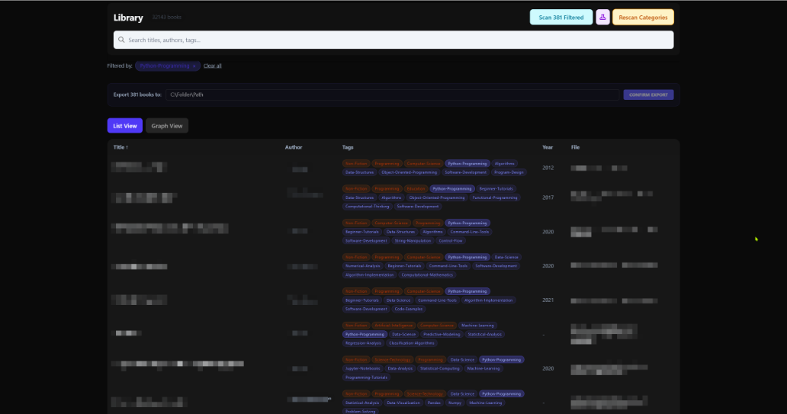
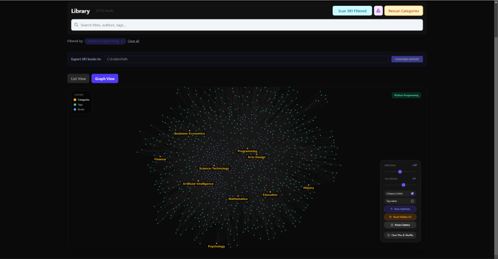

# Vector Bookshelf

Vector Bookshelf is a personal research library and book management tool that transforms a local directory of books into a structured knowledge base. Designed for researchers, students, and bibliophiles, it provides content-aware organization through local AI processing and interactive visualizations.

<a href="docs/images/list-view.png">
  
</a>
<a href="docs/images/graph-view.png">
  
</a>

## 🌟 Key Features

- **Personal AI Insight:** Uses integrated local AI to read your books and generate descriptive research tags and concise summaries.
- **Concept Discovery:** Explore your library through an interactive **Concept Graph**, revealing hidden thematic relationships between texts.
- **Privacy-First:** All processing (parsing and AI analysis) happens 100% on your machine. Your data never leaves your computer.
- **Smart Search & Filtering:** Instantly browse thousands of books by title, author, publication date, or AI-generated concepts.
- **Library Management:** Manual metadata editing with field-locking ensures your custom organization is never overwritten.
- **Curated Exports:** Filter your collection and export specific subsets to a folder, perfect for syncing to e-readers.

## 📥 Installation & Setup

Vector Bookshelf is a standalone desktop application.

1. **Download:** Get the latest installer for your operating system from the **[Releases](https://github.com/pbeens/Vector-Bookshelf/releases)** page.
2. **Install:** Run the installer and follow the on-screen instructions.
3. **Configure AI:**
   - The application requires a GGUF format AI model to generate tags and summaries.
   - We recommend `Llama-3.2-3B-Instruct-Q4_K_M.gguf` (or similar).
   - Place your model file in the `models/` folder located in your **User Data** directory:
     - **Windows**: `%AppData%\VectorBookshelf\models` (or `VectorBookshelf Dev` if testing)
     - **Mac**: `~/Library/Application Support/VectorBookshelf/models`
     - **Linux**: `~/.config/VectorBookshelf/models`
   - *Note: This folder is automatically created when you first launch the app.*
4. **Launch:** Start the application and select the local folder containing your PDF and EPUB files to begin building your library.

### 🏗️ Building from Source

If you prefer to build the application yourself:

1. **Prerequisites:** Node.js (v18+) and Git.
2. **Clone:** `git clone https://github.com/pbeens/Vector-Bookshelf.git`
3. **Install:** `npm install`
4. **Build:**

    ```powershell
    # Build the frontend and backend
    npm run build -w apps/web
    # Package for Windows
    npm run dist -w apps/desktop
    ```

5. **Run:** The installer will be generated in `apps/desktop/dist/`.

## 🛠 Technical Overview

Vector Bookshelf is built with performance and privacy in mind:

- **Core:** Node.js backend with a React (Vite) frontend.
- **Database:** SQLite (WAL mode) for stable and high-speed local data management.
- **AI Engine:** Embedded `llama.cpp` for hardware-accelerated local inference.
- **Visuals:** D3.js powered relationship mapping.

## 🔮 Future Development

We are actively exploring new features to expand the capabilities of Vector Bookshelf:

- **Multiple Library Support:** The ability to manage distinct collections (e.g., "Work", "Personal", "Research") and switch between them seamlessly.
- **Enhanced Metadata:** Fetching additional book details from online sources (optional/opt-in) to supplement local extraction.

## 📜 License

This project is licensed under the **GNU General Public License v3 (GPLv3)**.

- **Freedom:** You are free to run, study, share, and modify this software.
- **Copyleft:** Any modifications or derivative works must also be licensed under GPLv3.
- **Attribution:** Credit to the original author (Peter Beens) is required.

---
*Vector Bookshelf: Your local library, intelligently organized.*
